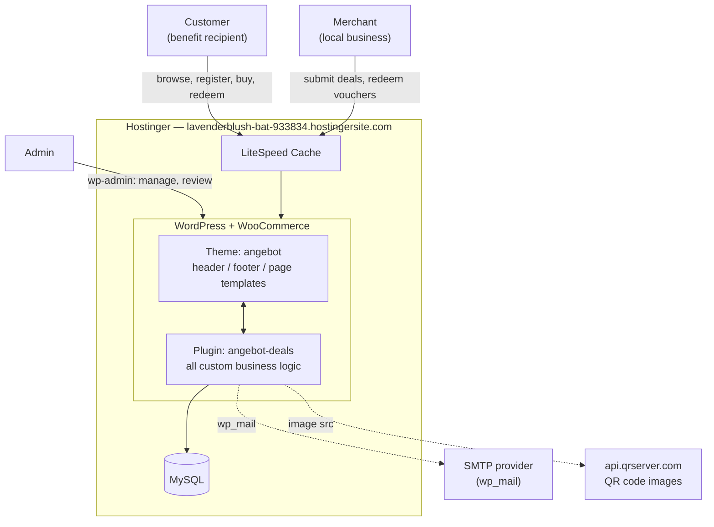
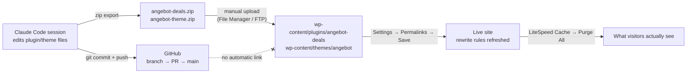
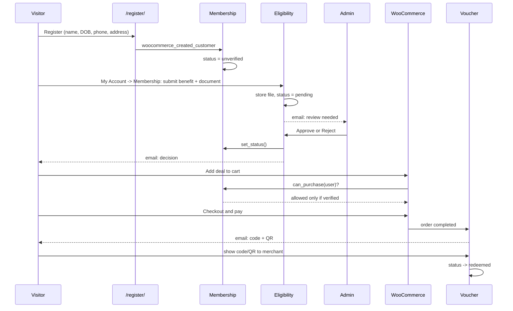
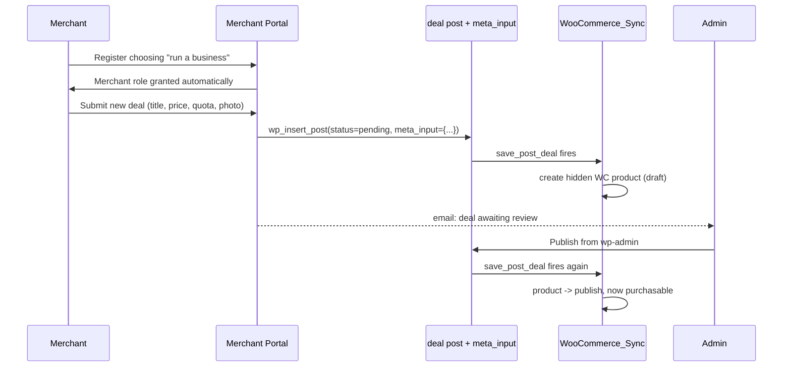

# Highbridge — Software Architecture

A WordPress + WooCommerce deals marketplace restricted to UK benefit recipients, with eligibility verification, a merchant self-service portal, and voucher redemption. This documents what exists today, how the pieces connect, and how a code change actually reaches the live site.

Repo: `3mothman/angebote-web` · Plugin: `angebot-deals` (v1.4.1) · Theme: `angebot` · Host: Hostinger

1. [System context](#1-system-context)
2. [Code → live site](#2-code--live-site-the-step-that-keeps-tripping-this-up)
3. [Plugin modules](#3-plugin-modules)
4. [Data model](#4-data-model)
5. [Roles & access](#5-roles--access)
6. [Key flows](#6-key-flows)
7. [Operational notes](#7-operational-notes)

## 1. System context

Everything runs inside one WordPress install. The theme handles layout; the plugin holds all Highbridge-specific business logic. Two external services are called over HTTP: an SMTP provider for outgoing mail, and a QR-code image API.

The plugin is the brain; the theme is the face. Both read/write the same WordPress database — there is no separate backend service.

## 2. Code → live site (the step that keeps tripping this up)

This is the single most important thing to understand about this project's workflow: **merging a pull request on GitHub changes nothing on the live site.** There is no CI/CD pipeline. GitHub and Hostinger are two disconnected places, joined only by a manual file copy.

The dotted crossed-out line is the trap: a merged PR (top path) never reaches the bottom path by itself. Every release needs the manual zip → upload → Permalinks → cache-purge sequence.

> **Why "it still doesn't work" after a merge.** Nearly every "the fix isn't showing up" issue in this project traced back to one of: the files were never re-uploaded to Hostinger, Permalinks weren't re-saved after uploading (new URLs 404), or LiteSpeed Cache served a stale/cached page from before the fix existed. Check these three, in this order, before assuming the code is wrong.

## 3. Plugin modules

`angebot-deals` is plain-PHP OOP (PHP 8, no framework). Every class is a static-method "service" registered once from `Angebot_Deals_Plugin::init()` and wired entirely through WordPress hooks — there is no central router or dependency container.

**Bootstrap**

| Module | File | Responsibility |
|---|---|---|
| Plugin | `class-plugin.php` | Singleton entry point. Registers every module's hooks; runs version-gated upgrades (new DB tables, capability grants, rewrite flush). |
| Activator / Deactivator | `class-activator.php` | Runs once on plugin activation: creates custom tables, seeds roles, creates auto-generated pages. |
| Autoloader | `class-autoloader.php` | Explicit class-name → file map, no Composer. |

**Catalogue**

| Module | File | Responsibility |
|---|---|---|
| Deal_CPT | `class-deal-cpt.php` | Registers the `deal` post type and its two taxonomies, `deal_category` and `deal_location`. |
| Deal_Meta | `class-deal-meta.php` | Price, quota, merchant, expiry etc. as post meta; renders/saves the wp-admin meta box. |
| WooCommerce_Sync | `class-woocommerce-sync.php` | Mirrors every deal into a hidden `WC_Product_Simple` so checkout, stock and pricing all run through WooCommerce untouched. |

**Membership & eligibility**

| Module | File | Responsibility |
|---|---|---|
| Membership | `class-membership.php` | Extra registration fields, the `/register/` page, the purchase gate (verified members only), My Account "Membership" tab. |
| Eligibility | `class-eligibility.php` | Benefit/proof submission, protected document storage, admin review queue, retention cleanup, privacy export/erase. |
| Impact | `class-impact.php` | Aggregates verified members, redemptions and savings for the admin dashboard and the public `[angebot_impact]` shortcode. |

**Commerce & redemption**

| Module | File | Responsibility |
|---|---|---|
| Voucher | `class-voucher.php` | Custom `wp_angebot_vouchers` table; generates a code + QR token per order line, tracks status, powers "My Deals". |
| Voucher_Email | `class-voucher-email.php` | HTML email with the code and QR image, sent on order completion. |
| QR_Code | `class-qr-code.php` | Builds the `/voucher/{token}/` redeem URL and the QR image src. |

**Merchant**

| Module | File | Responsibility |
|---|---|---|
| Merchant_Role | `class-merchant-role.php` | The `angebot_merchant` role and capabilities; restricts a merchant's wp-admin view and post ownership. |
| Merchant_Portal | `class-merchant-portal.php` | My Account "Merchant Portal" tab: submit a deal, see your deals, redeem a customer's voucher. |

**Front-end & content**

| Module | File | Responsibility |
|---|---|---|
| Shortcodes | `class-shortcodes.php` | Deal grid, filters, location picker, category bar. |
| Ajax_Filters / Location | `class-ajax-filters.php`, `class-location.php` | Live filtering and the city-cookie used to scope the catalogue. |
| Reviews / Legal_Pages / Demo_Content | `class-reviews.php` etc. | Moderated reviews, auto-created legal pages, one-click demo deals. |

## 4. Data model

No custom database abstraction — everything sits on WordPress's own tables plus three plugin-owned ones.

| Store | What it holds | Key fields |
|---|---|---|
| `deal` (CPT) | One row per deal listing | title, content, `post_status` (publish/pending), `post_author` |
| Deal post meta | Commerce details per deal | `_angebot_original_price`, `_angebot_deal_price`, `_angebot_quantity`, `_angebot_sold_count`, `_angebot_merchant_user_id` |
| `deal_category` / `deal_location` | Taxonomies on `deal` | hierarchical terms; rewrite slugs `deal-category` / `city` |
| WC product (hidden) | One per published deal, catalogue-hidden | mirrors price/stock; the thing that actually gets purchased |
| `wp_angebot_vouchers` | One row per unit purchased | code, qr_token, status, `user_id`, `merchant_user_id`, expires_at |
| `wp_angebot_eligibility` | One row per verification attempt | benefit_type, proof_type, file_path (protected dir), status, reviewed_by |
| `wp_angebot_reviews` | One row per deal review | rating, content, status (pending/approved) |
| User meta | Identity & membership state | `_angebot_membership_status`, `_angebot_date_of_birth`, billing_* fields, WP role(s) |

## 5. Roles & access

A user can be Customer and Merchant at once — the roles stack. Membership status (verified / pending / rejected) is a separate axis from role: it only gates checkout.

| | Customer | Merchant | Administrator |
|---|---|---|---|
| Browse deals | yes | yes | yes |
| Buy a deal | only if **verified** | only if **verified** | always |
| Submit eligibility proof | yes | yes | — |
| My Account → Membership / My Deals | yes | yes | yes |
| My Account → Merchant Portal | no | yes | yes |
| Submit a new deal | no | yes → goes to *pending* | yes → publishes immediately |
| Redeem a voucher | no | own deals only | any |
| Review eligibility submissions | no | no | yes |
| wp-admin dashboard | no menu access | Deals + Vouchers only | full |

## 6. Key flows

### Customer: register → verify → buy → redeem

Membership status is checked three times — add-to-cart, cart, and checkout — so a status change mid-cart still blocks the order.

### Merchant: submit a deal

`meta_input` on the initial insert matters: it sets price/quota before WooCommerce_Sync's first run, so the very first product sync already has correct data.

## 7. Operational notes

**New URL added? Flush permalinks.**
Every My Account tab (Membership, My Deals, Merchant Portal) and the `/register/` page are WordPress rewrite endpoints. After any deploy that touches routing, re-save **Settings → Permalinks** once — otherwise the new URL 404s even though the code is correct.

**Cache can outlive the fix.**
LiteSpeed Cache can keep serving a 404 or stale page from before a fix was deployed. If Permalinks are saved and it still looks broken, purge LiteSpeed Cache next.

**Email needs real SMTP.**
All notifications (`wp_mail`) use PHP's default mail transport unless an SMTP plugin is configured — unreliable on shared hosting, worse on a temporary `*.hostingersite.com` domain with no SPF/DKIM. Install WP Mail SMTP + a provider (Brevo, etc.) before relying on any email in this system.

**Eligibility documents are sensitive data.**
Stored in a deny-all `wp-content/uploads/angebot-eligibility/` folder, random filenames, served only through a capability-checked endpoint, auto-deleted after a configurable retention period. A DPIA is still required before collecting real submissions — this is engineering, not legal sign-off.

---

Reflects plugin v1.4.1 / branch `claude/funny-noether-uk1dcc`. Update this page when the module list or deploy process changes.
