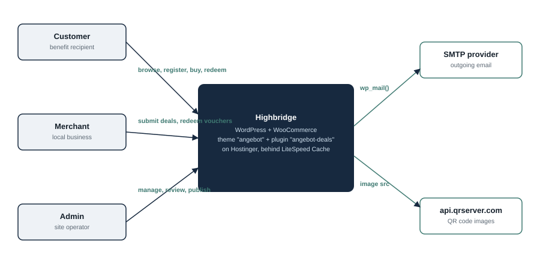
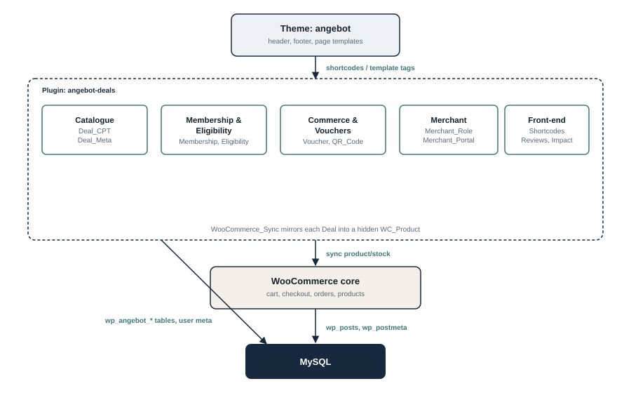
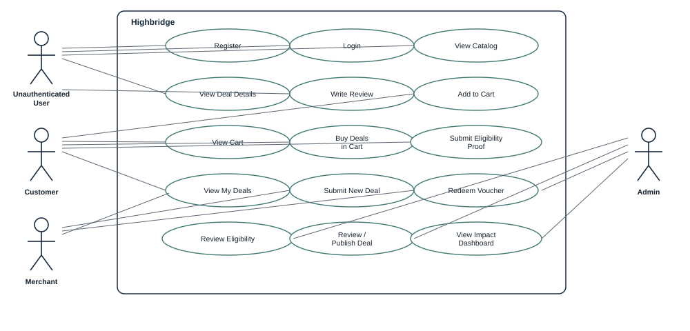
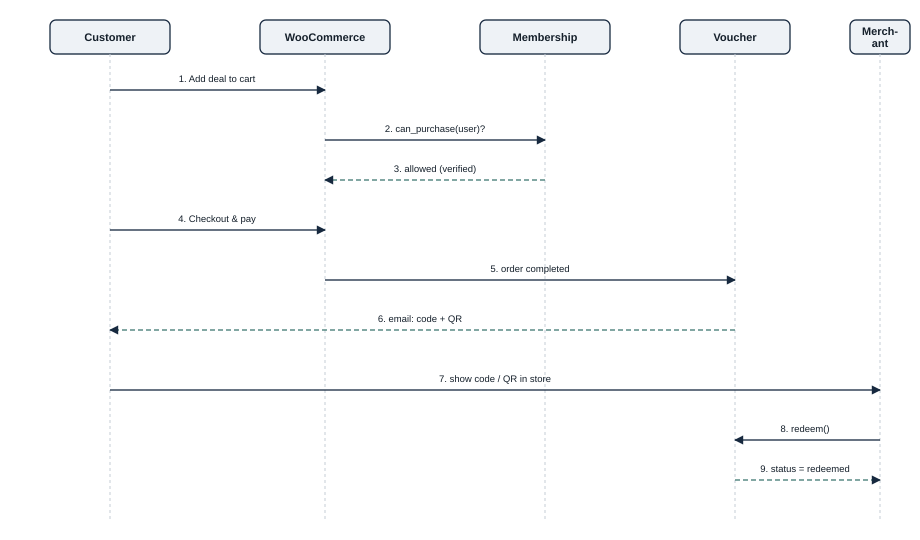
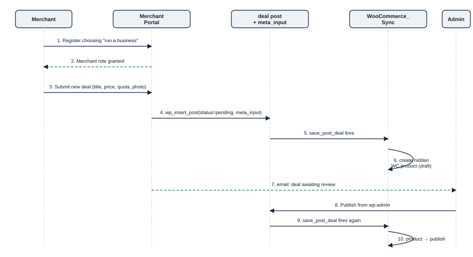
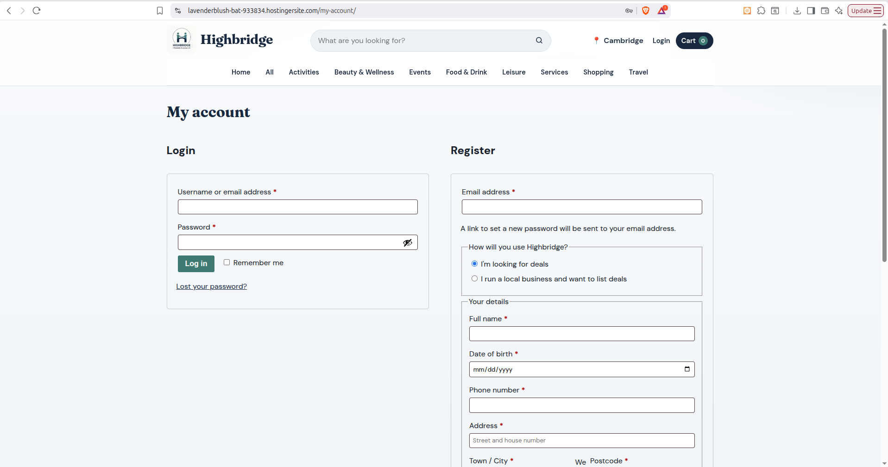
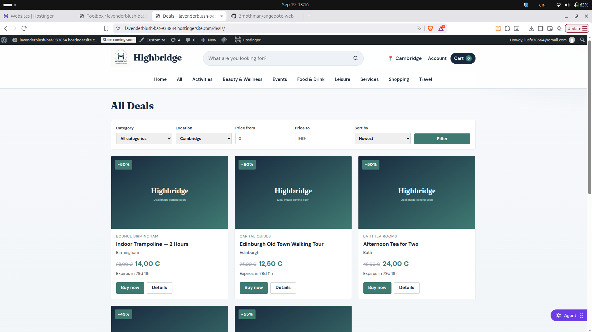
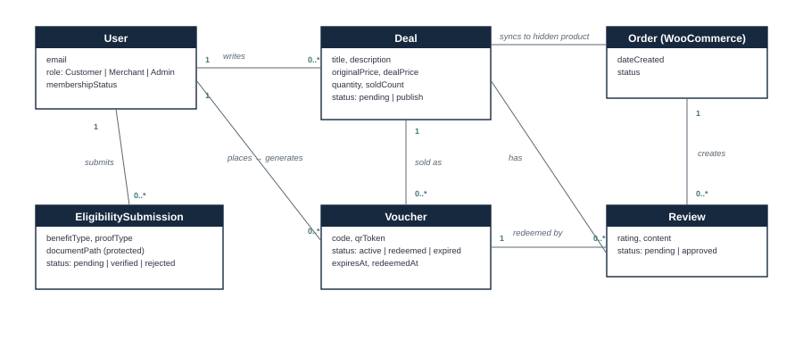

:project_name: Highbridge
:author: Mohammed Othman
:company_name: Highbridge
:revnumber: 1.0
:revdate: {docdatetime}
:revremark: Written against plugin v1.4.1 / theme "angebot"
:doctype: book
:icons: font
:source-highlighter: highlightjs
:toc: left
:numbered:

= Pflichtenheft __{project_name}__

[options="header"]
[cols="1, 3, 3"]
|===
|Version | Processing Date   | Author
|1.0    | September 2026    | Mohammed Othman
|===

== Purpose of this Document

This document is the Software Requirements Specification (SRS / Pflichtenheft) of the project **{project_name}**, a WordPress + WooCommerce deals marketplace restricted to UK government benefit recipients. It follows the structure used in the course "Softwaretechnologie-Projekt" (SalesPoint _Videoshop_ example) at Hochschule Merseburg, adapted for a real, already-implemented system.

Unlike the Videoshop template, which is written *before* implementation as a contract basis, this document was written *after* the system was built and is deployed. Where the template asks for a prototype, this document shows screenshots of the real, working application instead of mockups. Requirements are phrased as "the system shall", matching the template's convention, and describe what is actually implemented in the `angebot-deals` plugin and the `angebot` theme.

== Task Definition

The times when a benefit recipient could easily afford days out, meals, or wellness services on top of covering rent and bills are, for many, mostly over. {company_name} exists to close that gap: a members-only deals marketplace, open exclusively to people receiving UK government support, offering discounted local experiences from businesses (_Merchants_) willing to participate.

Our platform (_Highbridge_) can have any number of users (_User_) who interact with it differently. Every visitor may browse the catalog (_deals_) and see every offer (_Deal_) a merchant has listed, filtered by category and city. Unlike a normal deals site, not everyone may buy: only a _Customer_ whose UK benefit eligibility has been verified (_Membership_, status _verified_) is allowed to add a deal to their cart and check out.

Registration therefore asks more than an email and a password: a full name, date of birth, phone number and address, plus a choice of how the person intends to use the platform — as someone looking for deals, or as a local business that wants to list them (_Merchant_). A Customer must additionally submit proof of their benefit entitlement (_EligibilitySubmission_): which benefit they receive, what kind of proof they can provide, and the document itself. This submission is reviewed manually by an administrator (_Admin_), who approves or rejects it; only after approval can the Customer buy anything.

Whenever a Customer buys a Deal, the system automatically creates a voucher (_Voucher_) with a unique code and a QR code, emails it to them, and reduces the Deal's remaining quota. The Customer shows the code or QR in the merchant's shop; the Merchant (or an Admin) redeems it, marking it used. Merchants can also see every deal they have ever submitted and its status (_My Deals_), and Admins and Merchants can see an aggregate impact summary (_Impact Dashboard_): how many people have been helped and how much has been saved in total.

A Merchant does not need an Admin to create their account: choosing "I run a local business" at registration grants the Merchant role immediately. A Merchant can then submit a new Deal themselves from their My Account area; it is created in a pending state and only goes live once an Admin has reviewed and published it.

All of this must handle a category of especially sensitive data responsibly: benefit status and disability-related proof documents are special category data under UK GDPR, and are treated accordingly throughout — see <<NF0040>>.

== Product Usage

This section gives an overview of how the product is used in practice.

The system runs as a WordPress + WooCommerce web application, hosted on Hostinger, reachable through a browser 24/7. There is no native mobile app; the theme is responsive and tested down to phone width.

The system shall be accessible and visually functional in current versions of:

- Google Chrome
- Mozilla Firefox
- Safari (desktop and iOS)

The primary users of the software are:

- **Customers** — UK benefit recipients, who may have limited technical experience and are interacting with the system to save money on everyday purchases.
- **Merchants** — local business owners or staff, who use the system occasionally (submitting deals, redeeming vouchers at the till) and are not expected to have technical backgrounds.
- **Administrators** — the platform operator, who reviews eligibility submissions and deal listings and needs an efficient queue, not a general CMS.

The system does not require a database administrator: all data is stored in WordPress's own MySQL database and managed entirely through the WordPress admin and the custom pages this project adds on top of it.

[[Stakeholders]]
== Stakeholders

[options="header", cols="2, ^1, 4, 4"]
|===
|Name
|Priority (1..5)
|Description
|Goals

|{company_name}
|5
|The platform operator.
a|
- Restrict access to genuine UK benefit recipients
- Grow the number of participating local merchants
- Demonstrate measurable social impact (people helped, money saved)
- Stay UK GDPR compliant when handling eligibility documents

|Customers (benefit recipients)
|5
|Primary beneficiaries of the platform.
a|
- A straightforward, non-humiliating verification process
- A catalog they can trust and easily filter by city
- A simple way to prove and redeem a purchased deal

|Merchants (local businesses)
|4
|Businesses that list deals and redeem vouchers.
a|
- Reach benefit recipients without heavy marketing spend
- List a deal without needing an admin's help
- Reliably redeem a customer's voucher in-store

|Administrators
|3
|Operators reviewing submissions and content.
a|
- An efficient review queue for eligibility and deal submissions
- Confidence that sensitive documents are handled safely
- Visibility into overall impact

|Developers
|2
|People implementing or maintaining the plugin/theme.
a|
- A maintainable, hook-based plugin architecture
- A clear, documented deploy process
- Low regression risk when extending a module
|===

== System Boundaries and Component Structure

=== System Context Diagram

The system context diagram shows {project_name} in its environment: every actor, how they reach the system, and the third-party systems it talks to.

[[context_diagram]]

=== Top-level architecture

The theme (`angebot`) renders pages and delegates all business logic to the plugin (`angebot-deals`), organised into five module groups. The plugin mirrors every Deal into a hidden WooCommerce product so cart, checkout and stock all run through WooCommerce unmodified.

[[TLA]]

== Use-Cases

=== Actors

[options="header"]
[cols="1,4"]
[[registered_user]]
[[actors]]
|===
|Name |Description
|_User_               | Representative for every person interacting with the system, authenticated or not.
|_Registered User / Authenticated User_ | Representative for every person with an account who is authenticated.
|Unauthenticated User | Representative for unauthenticated visitors.
|Customer             | Any registered, authenticated user. May submit eligibility proof; may only buy deals once _verified_.
|Merchant             | Any registered, authenticated user with the Merchant role. May submit deals and redeem vouchers.
|Admin                | Any registered, authenticated user with administrator rights. Reviews eligibility and deal submissions, sees all data.
|===

=== Use-Case Diagram

[[use_case_diagram]]

=== Use-Case Descriptions

[cols="1h, 3"]
[[UC0010]]
|===
|ID                         |**<<UC0010>>**
|Name                       |Login
|Description                |A user shall be able to log in with email and password. Reversible by logging out.
|Actors                     |User
|Trigger                    |User selects "Login" on the My Account page.
|Precondition(s)           a|The user has an account.
|Essential Steps           a|
1. User opens `/my-account/`
2. User enters username/email and password
3. User presses "Log in"
|Extensions                 |-
|Functional Requirements    |<<F0010>>
|===

[cols="1h, 3"]
[[UC0020]]
|===
|ID                         |**<<UC0020>>**
|Name                       |Register
|Description                |An unauthenticated user shall be able to create an account, choosing whether they are looking for deals or want to list them as a business.
|Actors                     |Unauthenticated User
|Trigger                    |User presses "Register" and is taken to the dedicated `/register/` page.
|Precondition(s)           a|Actor is not logged in.
|Essential Steps           a|
1. Unauthenticated user opens `/register/`
2. User chooses "I'm looking for deals" or "I run a local business and want to list deals"
3. User enters email, password, full name, date of birth, phone number, and address
4. System validates the data (<<F0021>>)
5. Account is created; if "business" was chosen, the Merchant role is granted immediately
|Extensions                 a|
- Choosing "business" grants the Merchant role on top of the default Customer role (roles stack)
|Functional Requirements    |<<F0020>>, <<F0021>>
|===

[[sequence_diagram_buy]]
NOTE: A single sequence diagram is shown for the most complex use case (<<UC0220>>, spanning registration to redemption); see below.

[cols="1h, 3"]
[[UC0100]]
|===
|ID                         |**<<UC0100>>**
|Name                       |View Catalog
|Description                |Every visitor shall be able to view the catalog of deals, filterable by category, city, and price.
|Actors                     |User
|Trigger                    |User opens the site or clicks a category in the navigation.
|Precondition(s)           a|None
|Essential Steps           a|
1. User opens `/deals/` or a category link
2. User optionally sets category, city, or price filters
3. Matching deals are shown as cards with price, discount, and expiry
|Extensions                 |-
|Functional Requirements    |<<F0110>>, <<F0111>>, <<F0112>>
|===

[cols="1h, 3"]
[[UC0120]]
|===
|ID                         |**<<UC0120>>**
|Name                       |View Deal Details
|Description                |A user shall be able to open a deal's own page to see its full description, terms, and reviews.
|Actors                     |User
|Trigger                    |User clicks a deal card.
|Precondition(s)           a|User is viewing the catalog.
|Essential Steps           a|
1. User clicks a deal
2. User is shown the full description, highlights, fine print, reviews, and the buy button (state depends on <<UC0220>>'s preconditions)
|Extensions                 |-
|Functional Requirements    |<<F0120>>, <<F0130>>
|===

[cols="1h, 3"]
[[UC0200]]
|===
|ID                         |**<<UC0200>>**
|Name                       |Add Deal to Cart
|Description                |A verified Customer shall be able to add a deal to their WooCommerce cart.
|Actors                     |Customer
|Trigger                    |User presses "Buy now" on a deal.
|Precondition(s)           a|
- User is authenticated
- User's membership status is _verified_ (<<UC0300>>)
- Deal has remaining quota
|Essential Steps           a|
1. User presses "Buy now"
2. System checks membership status
3. If verified, the deal's linked WooCommerce product is added to the cart
|Extensions                 a|
- Not logged in → shown "Log in to buy" instead
- Logged in but not verified → shown "Verify your eligibility" / "Verification pending" instead, linking to <<UC0300>>
|Functional Requirements    |<<F0201>>, <<F0033>>
|===

[cols="1h, 3"]
[[UC0220]]
|===
|ID                         |**<<UC0220>>**
|Name                       |Buy Deals in Cart
|Description                |A verified Customer shall be able to check out the content of their cart and receive vouchers by email.
|Actors                     |Customer
|Trigger                    |Customer presses "Place order" at checkout.
|Precondition(s)           a|
- Cart is not empty
- Every deal product in the cart belongs to a verified Customer (checked again at checkout, not just at add-to-cart)
|Essential Steps           a|
1. Customer completes WooCommerce checkout and pays
2. Order status becomes "completed" / "processing"
3. System generates one Voucher (code + QR token) per unit purchased
4. System reduces each Deal's remaining quota
5. System emails the voucher(s) to the Customer
|Extensions                 a|
- Membership status changed to non-verified between add-to-cart and checkout → order is blocked with an error notice
|Functional Requirements    |<<F0220>>, <<F0230>>, <<F0240>>, <<F0301>>, <<F0302>>
|===

[[sequence_diagram_buy_full]]

[cols="1h, 3"]
[[UC0300]]
|===
|ID                         |**<<UC0300>>**
|Name                       |Submit Eligibility Proof
|Description                |A registered user shall be able to submit their benefit type, a proof type, and a supporting document for manual review.
|Actors                     |Customer, Merchant
|Trigger                    |User opens My Account → Membership and is not yet _verified_.
|Precondition(s)           a|
- User is authenticated
- User's current status is not _pending_ or _verified_ (no duplicate submission while one is in review)
|Essential Steps           a|
1. User selects a benefit type (e.g. Universal Credit, PIP, ESA, Pension Credit, Housing Benefit, Income Support, JSA, other)
2. User selects a proof type (e.g. entitlement letter, benefits-account screenshot, council letter)
3. User uploads a document (PDF/JPG/PNG, max 8MB) and ticks the explicit-consent checkbox
4. System stores the document in a protected, non-public location and sets status to _pending_
5. Admin is emailed (without the document attached)
|Extensions                 a|
- Invalid file type/size, missing consent, or missing fields → submission rejected with an error, nothing is stored
|Functional Requirements    |<<F0030>>, <<F0031>>
|===

[cols="1h, 3"]
[[UC0310]]
|===
|ID                         |**<<UC0310>>**
|Name                       |Review Eligibility Submission
|Description                |An Admin shall be able to approve or reject a pending eligibility submission.
|Actors                     |Admin
|Trigger                    |Admin opens Deals → Eligibility.
|Precondition(s)           a|User is authenticated with the `angebot_review_eligibility` capability.
|Essential Steps           a|
1. Admin opens the pending queue and views a submitted document through a capability-checked link
2. Admin approves (status → _verified_) or rejects with an optional note (status → _rejected_)
3. The submitting user is emailed the decision
|Extensions                 a|
- Rejected users may submit again (<<UC0300>>)
|Functional Requirements    |<<F0032>>
|===

[cols="1h, 3"]
[[UC0400]]
|===
|ID                         |**<<UC0400>>**
|Name                       |View My Deals
|Description                |A Customer shall be able to see every voucher they have bought and its live status.
|Actors                     |Customer
|Trigger                    |User opens My Account → My Deals.
|Precondition(s)           a|User is authenticated.
|Essential Steps           a|
1. User opens My Account → My Deals
2. System lists each voucher: deal title, code, status (active/redeemed/expired), and QR code if still active
|Extensions                 |-
|Functional Requirements    |<<F0400>>
|===

[cols="1h, 3"]
[[UC0410]]
|===
|ID                         |**<<UC0410>>**
|Name                       |Redeem Voucher
|Description                |A Merchant (or Admin) shall be able to look up a customer's voucher by code or QR and mark it redeemed.
|Actors                     |Merchant, Admin
|Trigger                    |Customer presents a code or QR code in-store.
|Precondition(s)           a|
- Actor is authenticated with the redeem capability
- Voucher belongs to one of the Merchant's own deals (Admins may redeem any)
|Essential Steps           a|
1. Merchant enters the code (or scans the QR, opening `/voucher/{token}/`)
2. System shows the deal, customer, and current status
3. Merchant presses "Redeem"; if the voucher is still active, its status becomes _redeemed_
|Extensions                 a|
- Already redeemed / expired / cancelled → redemption is refused with the reason shown
|Functional Requirements    |<<F0310>>
|===

[cols="1h, 3"]
[[UC0500]]
|===
|ID                         |**<<UC0500>>**
|Name                       |Submit New Deal
|Description                |A Merchant shall be able to submit a new deal from My Account without going through wp-admin.
|Actors                     |Merchant
|Trigger                    |Merchant opens My Account → Merchant Portal → "Submit a new deal".
|Precondition(s)           a|User is authenticated with the `angebot_submit_deal` capability.
|Essential Steps           a|
1. Merchant fills in title, category, city, original price, deal price, quota, description, optional photo
2. System creates the deal with status _pending_ and mirrors it into a hidden, draft WooCommerce product
3. Admin is emailed that a deal is awaiting review
|Extensions                 a|
- Submitted while logged in as an Admin → published immediately instead of _pending_ (used for quick testing)
|Functional Requirements    |<<F0500>>, <<F0501>>
|===

[cols="1h, 3"]
[[UC0510]]
|===
|ID                         |**<<UC0510>>**
|Name                       |Review / Publish Deal
|Description                |An Admin shall be able to review a pending deal and publish it from wp-admin.
|Actors                     |Admin
|Trigger                    |Admin opens the deal from the review-notification email or the Deals list.
|Precondition(s)           a|Deal status is _pending_.
|Essential Steps           a|
1. Admin opens the deal in wp-admin
2. Admin checks the details and presses "Publish"
3. The linked WooCommerce product is re-synced to _publish_, making the deal purchasable
|Extensions                 |-
|Functional Requirements    |<<F0502>>
|===

[[sequence_diagram_deal_submission]]

[cols="1h, 3"]
[[UC0600]]
|===
|ID                         |**<<UC0600>>**
|Name                       |View Impact Dashboard
|Description                |Admins shall see a detailed impact dashboard; the public shall see an aggregate, privacy-safe version.
|Actors                     |Admin, User
|Trigger                    |Admin opens Deals → Impact, or any visitor opens the "Our Impact" page.
|Precondition(s)           a|None for the public view; Admin capability for the admin view.
|Essential Steps           a|
1. System aggregates verified members, people helped, deals redeemed, and total savings
2. Admin view additionally shows redemptions over the last 6 months
|Extensions                 |-
|Functional Requirements    |<<F0600>>
|===

== Functional Requirements

[options="header", cols="2h, 1, 3, 12"]
|===
|ID
|Version
|Name
|Description

|[[F0010]]<<F0010>>
|v1.0
|Authentication
a|
The system shall separate publicly accessible parts from parts requiring authentication (email + password), using WordPress/WooCommerce's built-in login.

|[[F0020]]<<F0020>>
|v1.0
|Registration
a|
The system shall provide a dedicated `/register/` page (separate from login) where an unauthenticated user provides:

* Account type: "customer" or "business" (merchant)
* Email and password
* Full name, date of birth, phone number, address

Choosing "business" shall grant the Merchant role in addition to the default Customer role.

|[[F0021]]<<F0021>>
|v1.0
|Validate Registration
a|
The system shall validate all registration fields (non-empty full name, plausible past date of birth, phone format, non-empty address fields) and show field-specific errors on failure.

|[[F0030]]<<F0030>>
|v1.0
|Eligibility Verification Submission
a|
The system shall let an authenticated user submit a benefit type, a proof type, one document (PDF/JPG/PNG ≤ 8MB), and explicit consent, provided their current status is not _pending_ or _verified_.

|[[F0031]]<<F0031>>
|v1.0
|Validate Eligibility Submission
a|
The system shall reject a submission missing a valid benefit type, proof type, consent, or a valid document, without storing anything.

|[[F0032]]<<F0032>>
|v1.0
|Review Eligibility Submission
a|
The system shall let a user with the review capability approve or reject a pending submission with an optional note, update the member's status accordingly, and email the decision.

|[[F0033]]<<F0033>>
|v1.0
|Membership Status Gate
a|
The system shall block adding a deal to the cart, keeping it in the cart, and completing checkout unless the current user's membership status is _verified_ (administrators are exempt).

|[[F0100]]<<F0100>>
|v1.0
|Catalogue
a|
The system shall persistently store Deals as a custom post type with category and city taxonomies.

|[[F0110]]<<F0110>>
|v1.0
|View Catalog
a|
The system shall provide a page listing all published Deals as cards (image, price, discount, expiry, location).

|[[F0111]]<<F0111>>
|v1.0
|Filter Catalog
a|
The system shall let a user filter the catalog by category, city, and a price range, and sort by date or price.

|[[F0112]]<<F0112>>
|v1.0
|Location Picker
a|
The system shall remember a visitor's chosen city (cookie) and scope the catalog to it by default.

|[[F0120]]<<F0120>>
|v1.0
|View Deal Details
a|
The system shall provide a detail page per Deal showing title, images, full description, highlights, fine print, price, remaining quota, and reviews.

|[[F0130]]<<F0130>>
|v1.0
|Review Deals
a|
The system shall let a user submit a star rating and text review for a Deal; reviews shall require admin approval before appearing publicly.

|[[F0201]]<<F0201>>
|v1.0
|Add Deal to Cart
a|
The system shall add a Deal's linked WooCommerce product to the current user's cart in the desired quantity, subject to <<F0033>> and remaining quota.

|[[F0220]]<<F0220>>
|v1.0
|Buy Deals in Cart
a|
The system shall let a verified Customer complete WooCommerce checkout for the cart's contents.

|[[F0230]]<<F0230>>
|v1.0
|Validate Sufficient Quota
a|
The system shall refuse to add to cart or check out a quantity exceeding a Deal's remaining quota.

|[[F0240]]<<F0240>>
|v1.0
|Orders
a|
The system shall record each purchase as a standard WooCommerce order.

|[[F0301]]<<F0301>>
|v1.0
|Generate Voucher
a|
The system shall generate one Voucher (unique code + QR token) per purchased unit when an order is completed, and reduce the Deal's stock accordingly.

|[[F0302]]<<F0302>>
|v1.0
|Email Voucher
a|
The system shall email each Voucher's code and QR image to the purchasing Customer.

|[[F0310]]<<F0310>>
|v1.0
|Redeem Voucher
a|
The system shall let an authorised Merchant or Admin look up a Voucher by code or QR token and mark an _active_ Voucher _redeemed_, refusing already-redeemed, expired, or cancelled ones.

|[[F0400]]<<F0400>>
|v1.0
|My Deals
a|
The system shall provide a My Account page listing every Voucher belonging to the current user with its live status.

|[[F0500]]<<F0500>>
|v1.0
|Merchant Deal Submission
a|
The system shall provide a My Account "Merchant Portal" page where a user with the submit-deal capability can create a new Deal (title, category, city, prices, quota, description, photo), created with status _pending_.

|[[F0501]]<<F0501>>
|v1.0
|Merchant Self-Registration
a|
The system shall grant the Merchant role automatically at registration when "business" is chosen, without requiring an admin to assign it manually.

|[[F0502]]<<F0502>>
|v1.0
|Deal Review Queue
a|
The system shall keep a merchant-submitted Deal unpublished (and its linked WooCommerce product a draft) until an Admin publishes it.

|[[F0600]]<<F0600>>
|v1.0
|Impact Dashboard
a|
The system shall provide an admin dashboard and a public shortcode/page showing verified member count, people helped, deals redeemed, and total savings.

|===

== Non-Functional Requirements

=== Quality Demands

1 = Not Important .. 5 = Very Important
[options="header", cols="3h, ^1, ^1, ^1, ^1, ^1"]
|===
|Quality Demand           | 1 | 2 | 3 | 4 | 5
|Security (esp. eligibility data) |   |   |   |   | x
|Privacy / GDPR compliance |   |   |   |   | x
|Usability (non-technical users) |   |   |   | x |
|Maintainability          |   |   |   | x |
|Availability             |   |   | x |   |
|Performance              |   |   | x |   |
|===

=== Concrete NF Requirements

[options="header", cols="2h, 1, 3, 12"]
|===
|ID
|Version
|Name
|Description

|[[NF0010]]<<NF0010>>
|v1.0
|Availability
a|
The system shall run on standard shared hosting (Hostinger) behind a page cache (LiteSpeed Cache). No formal uptime SLA is guaranteed by the host; the plugin itself introduces no additional downtime risk.

|[[NF0020]]<<NF0020>>
|v1.0
|Security - Password Storage
a|
Passwords shall only be stored as hash values, using WordPress's own hashing.

|[[NF0030]]<<NF0030>>
|v1.0
|Security - Sensitive Document Storage
a|
Eligibility proof documents shall be stored in a non-public, deny-all-protected upload directory with randomised filenames, and served only through a capability-checked, nonced endpoint to the submitting user or an authorised reviewer.

|[[NF0040]]<<NF0040>>
|v1.0
|Data Protection (UK GDPR)
a|
Benefit type, disability-related proof, and identity documents are special category data under Art. 9 UK GDPR. The system shall capture explicit consent at submission, auto-delete documents after a configurable retention period, and expose the identity and eligibility data through WordPress's built-in personal-data export/erase tools. A Data Protection Impact Assessment is required before real submissions are collected; this requirement covers the technical safeguards only, not the legal sign-off.

|[[NF0050]]<<NF0050>>
|v1.0
|Usability - Responsive Design
a|
The theme shall remain usable down to common phone widths (~360px), as most Customers are expected to use a phone.

|[[NF0060]]<<NF0060>>
|v1.0
|Browser Support
a|
The system shall function correctly in current versions of Chrome, Firefox, and Safari (desktop and iOS).

|===

== GUI

Unlike a pre-implementation prototype, the images below are screenshots of the actual, deployed system.

[[register_image]]

NOTE: Login and registration have since been split into two separate pages (`/my-account/` for login, `/register/` for registration) to reduce clutter on this combined view; the fields themselves are unchanged.

[[catalog_image]]

== Data Model

=== Class Diagram

[[AKD]]

=== Classes and Enumerations

[options="header", cols="1h, 4"]
[[classes_enumerations]]
|===
|Class/Enumeration      |Description
|Highbridge             |Central system representing the marketplace itself.
|User                   |General representation of a real, authenticated person; may hold the Customer role, the Merchant role, or both.
|Customer               |A user allowed to buy Deals once their membership status is _verified_.
|Merchant               |A user allowed to submit Deals and redeem Vouchers for their own listings.
|Admin                  |A user with full administrative access: reviews eligibility submissions, publishes deals, redeems any voucher.
|Deal                   |A discounted offer listed by a Merchant, with an original price, a deal price, and a quota.
|Voucher                |A single purchased unit of a Deal: a unique code, a QR token, and a status.
|EligibilitySubmission  |One attempt by a User to prove benefit entitlement: benefit type, proof type, document, and a review decision.
|Review                 |A rating and comment left by a user about a Deal.
|Order                  |A standard WooCommerce order representing a completed purchase.
|MembershipStatus       |_unverified_: no submission yet. +
_pending_: submission awaiting review. +
_verified_: approved — may buy Deals. +
_rejected_: declined — may submit again.
|VoucherStatus          |_active_: not yet redeemed. +
_redeemed_: used in-store. +
_expired_: past its validity date. +
_cancelled_: order was cancelled/refunded.
|===

== Acceptance Testing

:Pre: Precondition(s)
:Event: Event
:Result: Expected Result

[[AT0020]]
[cols="1h, 4"]
|===
|ID            |<<AT0020>>
|Use Case      |<<UC0020>>
|{Pre}        a|An unauthenticated user is on `/register/`
|{Event}      a|The user chooses "I run a local business and want to list deals", fills in email, password, full name, date of birth, phone, and address, and submits.
|{Result}     a|
- A new account is created with the Customer role **and** the Merchant role
- The account can log in immediately
- My Account now shows a "Merchant Portal" entry
|===

[[AT0021]]
[cols="1h, 4"]
|===
|ID            |<<AT0021>>
|Use Case      |<<UC0020>>
|{Pre}        a|An unauthenticated user is on `/register/`
|{Event}      a|The user chooses "I'm looking for deals" and registers with valid data.
|{Result}     a|
- A new account is created with only the Customer role
- My Account does **not** show a "Merchant Portal" entry
- Membership status is _unverified_
|===

[[AT0200]]
[cols="1h, 4"]
|===
|ID            |<<AT0200>>
|Use Case      |<<UC0200>>
|{Pre}        a|A Customer is logged in with membership status _unverified_
|{Event}      a|The Customer presses "Buy now" on a Deal.
|{Result}     a|
- The deal is **not** added to the cart
- The Customer instead sees a "Verify your eligibility" call-to-action linking to My Account → Membership
|===

[[AT0300]]
[cols="1h, 4"]
|===
|ID            |<<AT0300>>
|Use Case      |<<UC0300>>
|{Pre}        a|A Customer is logged in with membership status _unverified_
|{Event}      a|The Customer submits a benefit type, a proof type, a valid PDF document, and ticks consent.
|{Result}     a|
- Membership status becomes _pending_
- The admin notification email address receives a review-needed email (without the document attached)
- The Customer receives a confirmation email
|===

[[AT0310]]
[cols="1h, 4"]
|===
|ID            |<<AT0310>>
|Use Case      |<<UC0310>>
|{Pre}        a|A submission from <<AT0300>> is _pending_
|{Event}      a|An Admin opens Deals → Eligibility and approves it.
|{Result}     a|
- The submission's status becomes _verified_
- The Customer's membership status becomes _verified_
- The Customer receives a decision email
- The Customer can now complete <<UC0200>> and <<UC0220>>
|===

[[AT0500]]
[cols="1h, 4"]
|===
|ID            |<<AT0500>>
|Use Case      |<<UC0500>>
|{Pre}        a|A Merchant is logged in
|{Event}      a|The Merchant submits a new deal with all required fields via My Account → Merchant Portal.
|{Result}     a|
- The deal appears under "Your deals" with status "Pending review"
- The admin notification email address receives a review-needed email
- The deal is not visible or purchasable on the public catalog yet
|===

[[AT0410]]
[cols="1h, 4"]
|===
|ID            |<<AT0410>>
|Use Case      |<<UC0410>>
|{Pre}        a|A Customer holds an _active_ Voucher for a Merchant's deal
|{Event}      a|The Merchant looks up the voucher code in the Merchant Portal and presses "Redeem".
|{Result}     a|
- The voucher's status becomes _redeemed_
- A second redemption attempt of the same code is refused
|===

[[Glossary]]
== Glossary

[options="header", cols="1h, 4"]
[[glossar]]
|===
|Term                   |Description
|Admin                  |Synonym for Administrator; full access to review and manage the system.
|Benefit recipient      |A person receiving UK government support (Universal Credit, PIP, ESA, etc.) — the platform's intended Customer.
|Deal                   |See <<classes_enumerations, domain overview>>.
|Eligibility            |The verification process proving a Customer is a genuine benefit recipient.
|Membership             |A user's overall status (unverified/pending/verified/rejected) that gates purchasing.
|Merchant               |See <<classes_enumerations, domain overview>>.
|Merchant Portal        |The My Account page/tab where a Merchant submits deals, tracks them, and redeems vouchers.
|Quota                  |The number of units of a Deal still available for purchase.
|Redemption             |The act of a Merchant marking a Voucher as used, after a Customer presents it in-store.
|Special category data  |Data revealing health, disability, or similarly sensitive attributes, protected under Art. 9 UK GDPR — applies to eligibility proof documents.
|Voucher                |See <<classes_enumerations, domain overview>>.
|===
